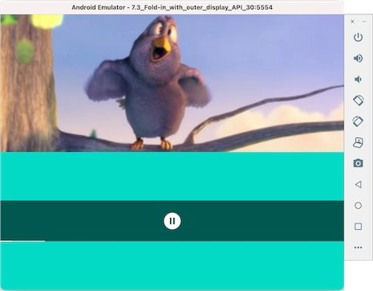

# Folding Video

Attempting to reproduce the [WindowManager+MotionLayout+ExoPlayer demo](https://www.youtube.com/watch?v=jIBNhxyciLQ) from Google I/O 2021.

## References

- [Foldables - WindowManager with MotionLayout (video)](https://www.youtube.com/watch?v=jIBNhxyciLQ)
- [ConstraintLayout training](https://developer.android.com/training/constraint-layout)
- [MotionLayout training](https://developer.android.com/training/constraint-layout/motionlayout)
- [ExoPlayer documentation](https://exoplayer.dev/)
- [ExoPlayer Codelab](https://developer.android.com/codelabs/exoplayer-intro#0)
- [ExoPlayer code (GitHub)](https://github.com/google/ExoPlayer)
- [What’s new in foldables, tablets, and large screens (video)](https://www.youtube.com/watch?v=Qkiz3QIPJzk)

## Source project

- [ConstraintLayout/FoldableExperiments (GitHub)](https://github.com/androidx/constraintlayout/tree/main/projects/FoldableExperiments)
- [LICENCE](https://github.com/androidx/constraintlayout/blob/main/LICENSE)

## Video file referenced

(c) copyright 2008, Blender Foundation / [www.bigbuckbunny.org](https://www.bigbuckbunny.org)