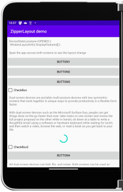
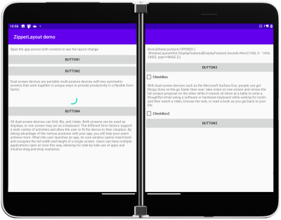
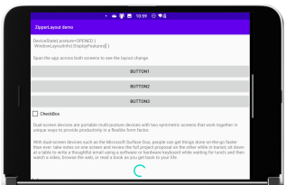
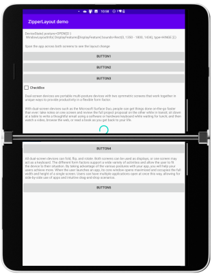

# ZipperLayout dual-screen control sample

Sample app that demonstrates a simple custom control based on `LinearLayout` that places child elements on either side of the hinge on a dual-screen Android device like the Surface Duo.

In single-screen modes not all the child elements will be visible, so the layout should be used with that in mind.

| Portrait views | Landscape views |
|-|-|
|   |   |

## References

- [Surface Duo docs](https://docs.microsoft.com/dual-screen)
- [Surface Duo blog](https://devblogs.microsoft.com/surface-duo)
- [Android Jetpack Window Manager](https://medium.com/androiddevelopers/support-new-form-factors-with-the-new-jetpack-windowmanager-library-4be98f5450da) - Android developer blog
- [Creating a custom view class](https://developer.android.com/training/custom-views/create-view) - Android developer docs
